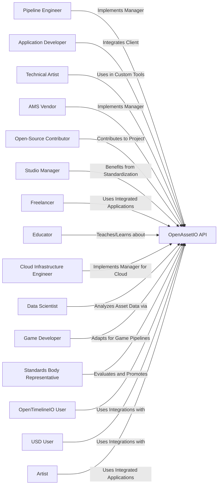

```mermaid
graph LR
    OpenAssetIO["OpenAssetIO API"]

    PipelineEngineer["Pipeline Engineer"] -->|Implements Manager| OpenAssetIO
    AppDeveloper["Application Developer"] -->|Integrates Client| OpenAssetIO
    TechArtist["Technical Artist"] -->|Uses in Custom Tools| OpenAssetIO
    AMSVendor["AMS Vendor"] -->|Implements Manager| OpenAssetIO
    Contributor["Open-Source Contributor"] -->|Contributes to Project| OpenAssetIO
    StudioManager["Studio Manager"] -->|Benefits from Standardization| OpenAssetIO
    Freelancer["Freelancer"] -->|Uses Integrated Applications| OpenAssetIO
    Educator["Educator"] -->|Teaches/Learns about| OpenAssetIO
    CloudEngineer["Cloud Infrastructure Engineer"] -->|Implements Manager for Cloud| OpenAssetIO
    DataScientist["Data Scientist"] -->|Analyzes Asset Data via| OpenAssetIO
    GameDeveloper["Game Developer"] -->|Adapts for Game Pipelines| OpenAssetIO
    StandardsRep["Standards Body Representative"] -->|Evaluates and Promotes| OpenAssetIO
    OTLUser["OpenTimelineIO User"] -->|Uses Integrations with| OpenAssetIO
    USDUser["USD User"] -->|Uses Integrations with| OpenAssetIO
    Artist["Artist"] -->|Uses Integrated Applications| OpenAssetIO
```
