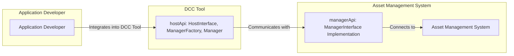

```mermaid
graph LR
    subgraph "Application Developer"
        AppDev["Application Developer"]
    end
    subgraph "DCC Tool"
        HostAPI["hostApi: HostInterface, ManagerFactory, Manager"]
    end
    subgraph "Asset Management System"
        ManagerAPI["managerApi: ManagerInterface Implementation"]
        AMS["Asset Management System"]
    end
    AppDev -->|Integrates into DCC Tool| HostAPI
    HostAPI -->|Communicates with| ManagerAPI
    ManagerAPI -->|Connects to| AMS
```
