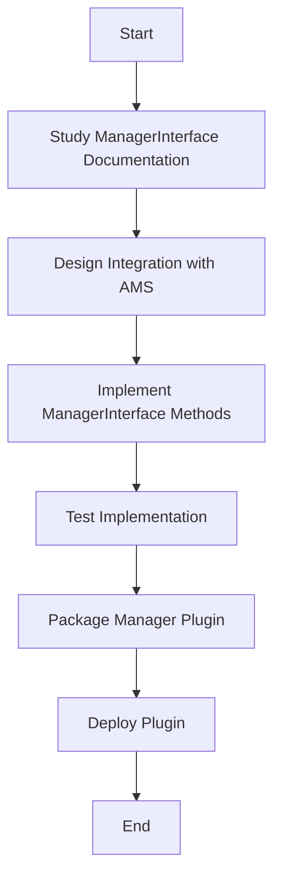
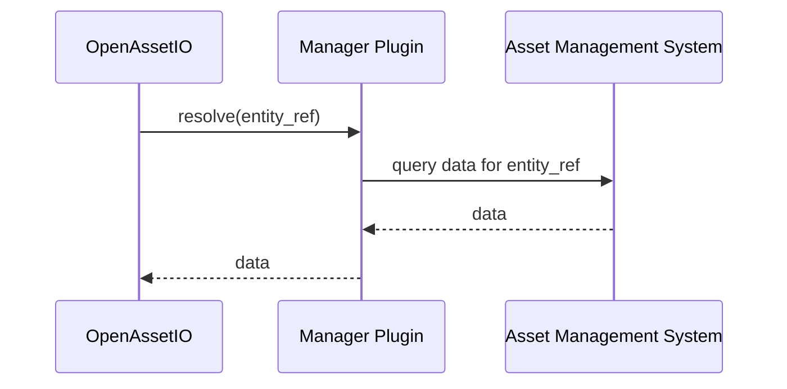

```mermaid
%% Pipeline Engineer and AMS Vendor: Activity Diagram - Implementing the Manager
graph TD
    A2[Start]
    B2[Study ManagerInterface Documentation]
    C2[Design Integration with AMS]
    D2[Implement ManagerInterface Methods]
    E2[Test Implementation]
    F2[Package Manager Plugin]
    G2[Deploy Plugin]
    H2[End]

    A2 --> B2
    B2 --> C2
    C2 --> D2
    D2 --> E2
    E2 --> F2
    F2 --> G2
    G2 --> H2
```

```mermaid
%% Pipeline Engineer and AMS Vendor: Sequence Diagram - Handling the Resolve Request
sequenceDiagram
    participant OAIO as OpenAssetIO
    participant Plugin as Manager Plugin
    participant AMS as Asset Management System

    OAIO->>Plugin: resolve(entity_ref)
    Plugin->>AMS: query data for entity_ref
    AMS-->>Plugin: data
    Plugin-->>OAIO: data
```
