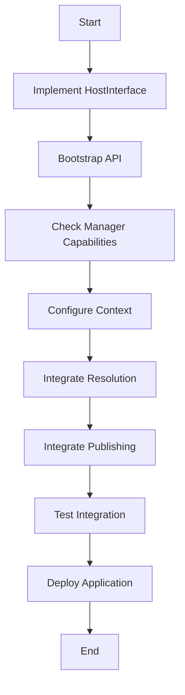
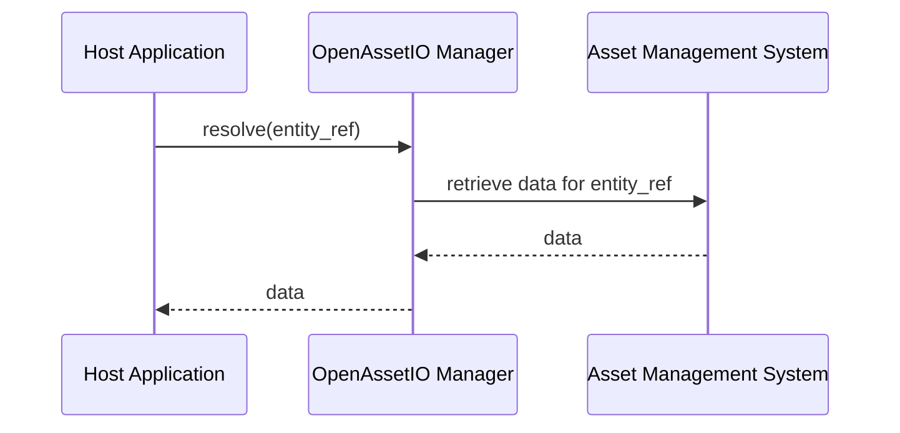

# Application Developer Persona

## Activity Diagram - Integrating OpenAssetIO into a Host Application

```mermaid
%% Application Developer: Activity Diagram - Integrating OpenAssetIO into a Host Application
graph TD
    A[Start]
    B[Implement HostInterface]
    C[Bootstrap API]
    D[Check Manager Capabilities]
    E[Configure Context]
    F[Integrate Resolution]
    G[Integrate Publishing]
    H[Test Integration]
    I[Deploy Application]
    J[End]

    A --> B
    B --> C
    C --> D
    D --> E
    E --> F
    F --> G
    G --> H
    H --> I
    I --> J
```

## Sequence Diagram - Resolving an Entity Reference

```mermaid
%% Application Developer: Sequence Diagram - Resolving an Entity Reference
sequenceDiagram
    participant Host as Host Application
    participant Manager as OpenAssetIO Manager
    participant AMS as Asset Management System

    Host->>Manager: resolve(entity_ref)
    Manager->>AMS: retrieve data for entity_ref
    AMS-->>Manager: data
    Manager-->>Host: data
```
